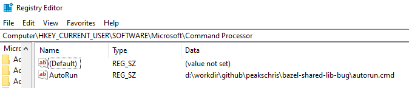

## Bazel shared lib bug

Wrapper bat scripts called by cc toolchain do not appear to be invoked with cmd /d. This example demonstrates the issue in a call to setup toolchain, we have vendored toolchain and introduced a wrapper around link.exe and that is where we saw the problem.

### To reproduce:
- bazel build //...
- _note, success_

- bazel clean --expunge
- regedit
- create HKEY_CURRENT_USER\Software\Microsoft\Command Processor\AutoRun
  - create parent keys if required
  - set AutoRun to <path_to>\autorun.cmd
- bazel build //...
- _note, failure_

